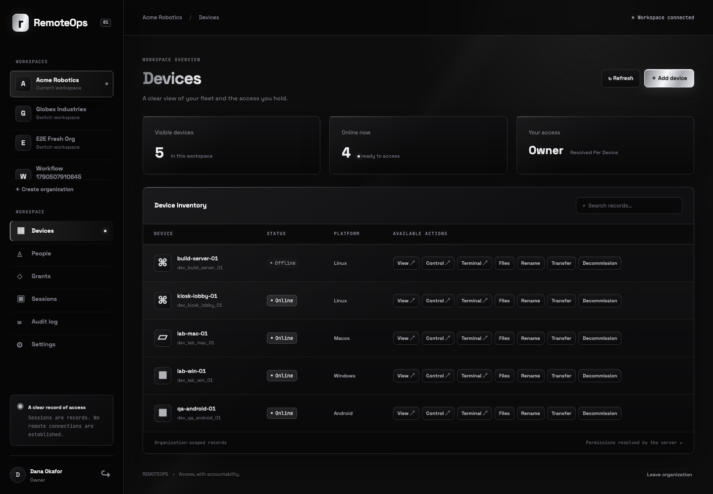

# RemoteOps

## About

RemoteOps is a secure, multi-organization access-control console for managing people, devices, permissions, and session records from one workspace. It combines a React dashboard, Node.js HTTP API, and SQLite database in a single process.

Every action is resolved against live server-side authority. A person can hold a different role in each organization, grants can allow or deny access by device and time window, and the interface renders only the actions the server authorizes. RemoteOps records sessions and audit events; it does not establish remote connections, capture screens, inject input, execute shells, or transfer files.



## Repository guide

| Path | Purpose |
|---|---|
| `starter/web/` | React console, HTTP adapter, and development-only mock adapter |
| `starter/server/` | Authentication, authorization, lifecycle, audit, and API routes |
| `starter/db/` | Unmodified SQLite schema and reference catalogue |
| `starter/tests/` | Browser contract and end-to-end workflow checks |
| `starter/scripts/` | Database loader, required suites, hardening, and measurements |
| `BUILD-LOG.md` | Chronological implementation record |
| `DECISIONS.md` | Design choices, evidence, rejected alternatives, and sources |
| `VERIFICATION.md` | Recorded suite results and clean-checkout evidence |
| Root specification files | Original candidate requirements retained for review |

## Run from a clean checkout

Node.js 22+ and npm are required. Tested with Node 25.8.1 on macOS. Run from the repository root:

```sh
cd starter && npm install && npm run db:reset && npm run dev
```

Open http://localhost:8080. The reset command is for first setup/testing and **deletes the local app database**. On subsequent launches use `cd starter && npm run dev`.

| Demo login | Password | Organizations |
|---|---|---|
| dana@example.test | demo1234 | Owner in Acme; viewer in Globex |
| sam@example.test | demo1234 | Operator in Acme; auditor in Globex |
| admin@acme.test | demo1234 | Administrator in Acme |
| viewer@acme.test | demo1234 | Viewer in Acme |

The loader also prints the personalized fixture account. Roles and permissions are read from the database; the undocumented catalogue entries work without source edits.

## Verify

From `starter/`:

```sh
node scripts/check-jwt.js
node scripts/check-permissions.js
node scripts/check-api.js
npm run build
npx playwright install chromium
npx playwright test
npm run personalisation
npm run check:hardening
npm run measure
```

The four requested submission summaries are JWT, permissions, API, and Playwright. Extra hardening and personalization checks supplement them. See `VERIFICATION.md` for actual recorded results and limitations.

## Frontend preview and production build

The default UI uses the real API. For an explicit development preview only:

```sh
VITE_USE_MOCK_API=true npm run dev
```

Mock login accepts a populated email and `demo1234`. Mock responses are development fixtures, not an authorization implementation. Production builds exclude the mock module.

```sh
npm run build
npm start
```

Before exposing the application beyond local testing, set `JWT_SECRET` and `APP_HASH_KEY` to separate random secrets and serve over HTTPS. Existing starter defaults are local demo values, not production credentials. Refresh cookies use Secure, HttpOnly, and SameSite=Strict. Modern browsers support Secure cookies on localhost; use HTTPS for non-localhost hosts. Optional variables: `PORT` (8080), `DATABASE_FILE` (app.db), `CANDIDATE_NONCE` (personalization override).

## Architecture and behavior

- `starter/web/`: React screens, accessible forms, organization identity, and interchangeable API adapters. Buttons render from the server's resolved permission set; there is no role matrix in React.
- `starter/server/permissions.js`: database-driven permission resolver, deny precedence, wildcard/time/device scope, batched device resolution, and grant authority checks. Request-local reuse only.
- `starter/server/routes/`: published API plus read-only catalogue and logout endpoints. Scoped queries hide foreign resources. Mutation transactions recheck identity after request-body reads.
- `starter/server/lifecycle.js`: last-owner protection, session expiry and tenancy cascades. Permission changes invalidate future requests but preserve existing session snapshots until TTL.
- SQLite schema, foreign keys, partial indexes, and append-only audit triggers are retained unchanged. Successful mutations and their audit events share a transaction; denied attempts are logged after rollback.
- Refresh rotation is serialized in-tab and, when available, across browser tabs with Web Locks. Access tokens remain in memory; refresh and invitation credentials are hashed at rest.

The original candidate specifications remain at the root. Reference solution and organizer-only material are excluded from the current submission tree; upstream history remains intact.

## Work record and authorship

Solo submitter: Priyansh Jha. Implementation was assisted by OpenAI Codex. `BUILD-LOG.md` records actual agent work and verification as it occurred; `DECISIONS.md` cites tools and explains choices and alternatives. The submitter must review, understand, and be able to modify every submitted line without assistance in the live walkthrough.

## Deliberate boundaries

No real remote access, email service, password-reset system, or deployment is included. Invite links are returned once for the intended recipient. Audit shows the most recent 200 records in the UI; the API supports validated pagination. Search filters the fetched page locally. The schema and reference catalogue are not editable through the console.
